# OpenVLA × LIBERO-Spatial LoRA 微调与 π₀.₅ 横向对比

在 [OpenVLA-7B](https://github.com/openvla/openvla) 上对 **LIBERO-Spatial** 进行 LoRA 微调，完成 5 组超参消融训练，并在仿真中评测；同时接入 [Physical Intelligence OpenPI](https://github.com/Physical-Intelligence/openpi) 官方 **π₀.₅-LIBERO**  checkpoint 作**同协议横向对比**。本仓库包含 **补丁**、**自动化脚本**、**实验日志** 与 **rollout 视频**，**不包含**完整上游 OpenVLA / OpenPI 代码树。

**仓库地址：** [github.com/ZhihaoZhang01/openvla-libero-spatial-finetune](https://github.com/ZhihaoZhang01/openvla-libero-spatial-finetune)

> **关于演示动画：** GitHub 首页 README **不支持**内嵌相对路径的 `<video>` 标签，因此下文用 **GIF 预览** 展示关键片段；完整 **MP4** 见各段下方的「观看原片」链接，或目录 [`experiments/rollouts/2026_05_24/`](experiments/rollouts/2026_05_24/)（150 个文件）。

---

## 项目概览

| 项目 | 说明 |
|------|------|
| 基座模型 | OpenVLA-7B |
| 基准任务 | LIBERO-Spatial（`libero_spatial_no_noops`） |
| 微调方式 | LoRA（`rank=32`，`lr=5e-4`，`batch=16`） |
| 训练硬件 | NVIDIA A800 80GB（AutoDL） |
| OpenVLA 最优 | **S10k** — 10000 step，`dropout=0.1`，关闭图像增强 |
| 横向基线 | **π₀.₅-LIBERO**（OpenPI 官方 checkpoint，`pi05_libero`） |
| 评测协议 | 前 **3 个任务** × 每任务 **10 次 trial** = 每模型 **30** 个 episode |

### 仿真成功率（同协议：3 任务 × 10 trials）

| 排名 | 模型 | 类型 | 训练步数 | Dropout | 图像增强 | 总成功率 |
|------|------|------|----------|---------|----------|----------|
| 1 | **π₀.₅-LIBERO** | OpenPI 官方微调 | — | — | — | **100%**（30/30） |
| 2 | **S10k** | OpenVLA LoRA | 10000 | 0.1 | 关 | **70.0%**（21/30） |
| 3 | **A-F** | OpenVLA LoRA | 6500 | 0.0 | 关 | **50.0%**（15/30） |
| 4 | D1 | OpenVLA LoRA | 6500 | 0.1 | 开 | 26.7%（8/30） |
| 5 | D0 | OpenVLA LoRA | 6500 | 0.0 | 开 | 16.7%（5/30） |
| 6 | S3k | OpenVLA LoRA | 3000 | 0.0 | 开 | 0.0%（0/30） |

- OpenVLA 批次：`20260522-eval` · π₀.₅ 批次：`20260526-200803-pi05`
- 分任务明细见 [`experiments/REPORT_libero_spatial_sweep_20260522.md`](experiments/REPORT_libero_spatial_sweep_20260522.md) 与 [`experiments/results.csv`](experiments/results.csv)

### OpenVLA LoRA vs π₀.₅-LIBERO（简要对比）

| 维度 | OpenVLA（本仓库 S10k） | π₀.₅-LIBERO（OpenPI 官方） |
|------|------------------------|----------------------------|
| 架构 | 7B VLA + LoRA 微调 | ~3.3B π₀.₅ + LIBERO 全量微调 |
| 观测 | 单相机 + `center_crop` 策略因配置而异 | **双相机**（agentview + wrist） |
| 动作 | 逐步离散 token 反量化 | **action chunk**（默认 replan 每 5 步） |
| 本协议 3×10 成功率 | **70%** | **100%** |
| 训练成本 | 单卡 A800，~数小时 LoRA | 官方预训练权重，本地仅推理评测 |

**解读：** 在**相同 3 个 spatial 任务、相同 trial 数**下，π₀.₅ 显著高于本组 OpenVLA LoRA 最优（S10k）。差距来自模型容量、官方 LIBERO 专用训练、双相机与 chunk 策略等，**不宜**与 OpenPI 论文中 **全套 10 任务 × 50 trials** 的 numbers 直接对比。本仓库价值在于：**固定子集协议**下，LoRA 消融结论（aug / dropout / 步数）与强基线的相对位置。

---

## 阶段一：Quick Start 冒烟（基座模型）

微调前，用 `run/quick_start.py` 在**未微调**的 OpenVLA-7B 上跑通整条链路（GPU、LIBERO 仿真、模型加载），确认环境可用。

### 基座模型 Rollout

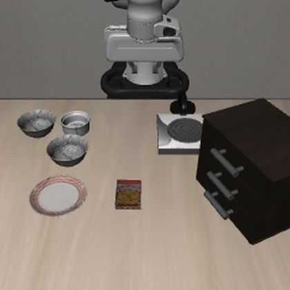

[▶ 观看 MP4 原片](experiments/demos/quick_start_spatial_pick_black_bowl.mp4)

*任务：拿起黑碗并放到盘子上。基座模型机械臂几乎不动。*

---

## 阶段二：消融训练 — 训练曲线

五组 LoRA 实验（训练批次 `20260522-train`）。固定超参：`lora_rank=32`，`lr=5e-4`，`batch=16`，数据集 `libero_spatial_no_noops`。

| 编号 | `lora_dropout` | `image_aug` | `max_steps` | 说明 |
|------|----------------|-------------|-------------|------|
| D0 | 0.0 | 开 | 6500 | 基线 |
| D1 | 0.1 | 开 | 6500 | Dropout 消融 |
| A-F | 0.0 | **关** | 6500 | 关闭图像增强 |
| S3k | 0.0 | 开 | **3000** | 短训（步数不足） |
| S10k | 0.1 | **关** | **10000** | 长训（最优） |

### 总览对比（W&B 导出，5 条 run 叠加）

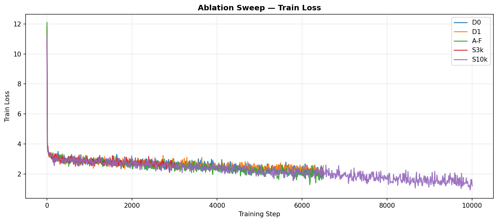

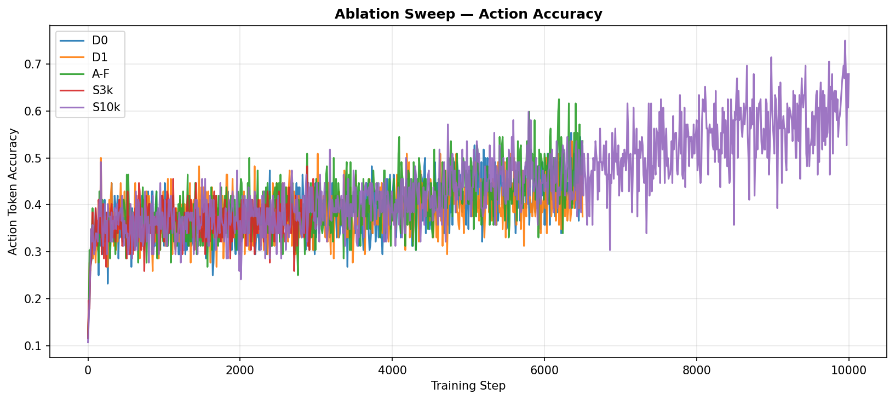

| 配置 | 末 step | `train_loss` | `action_accuracy` | `l1_loss` |
|------|---------|--------------|-------------------|-----------|
| D0 | 6500 | 2.10 | 44.6% | 0.076 |
| D1 | 6500 | 2.56 | 37.5% | 0.106 |
| A-F | 6500 | 1.70 | 53.6% | 0.045 |
| S3k | 3000 | 2.72 | 35.7% | 0.130 |
| S10k | 10000 | **1.20** | **67.9%** | **0.026** |

### 各实验单独曲线

| D0 @ 6500 | D1 @ 6500 |
|-----------|-----------|
| 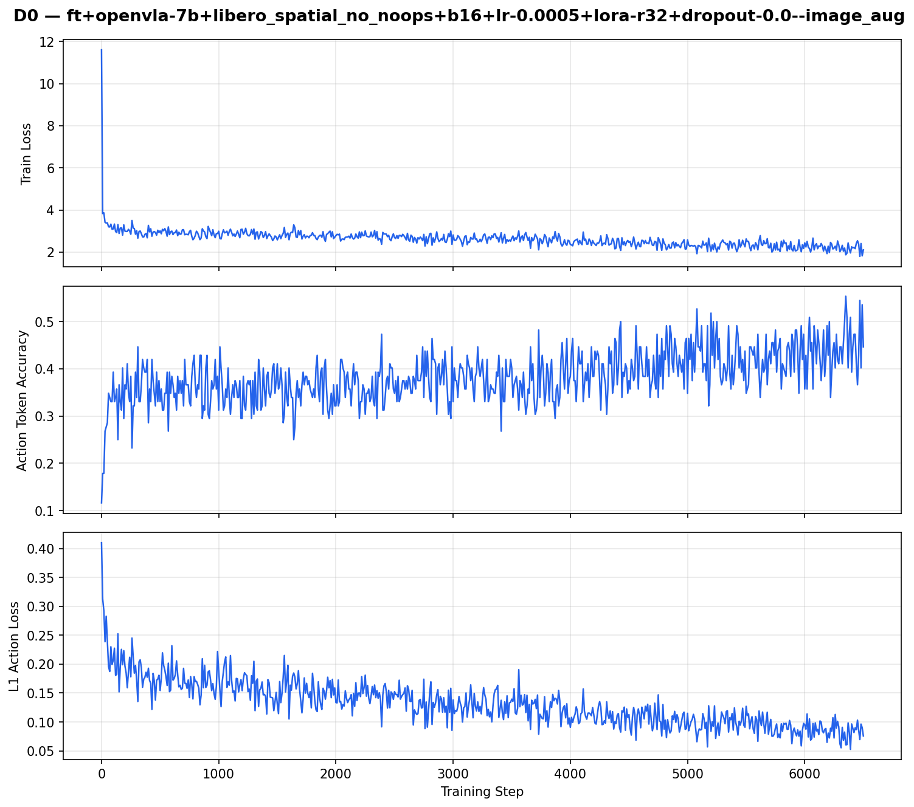 | 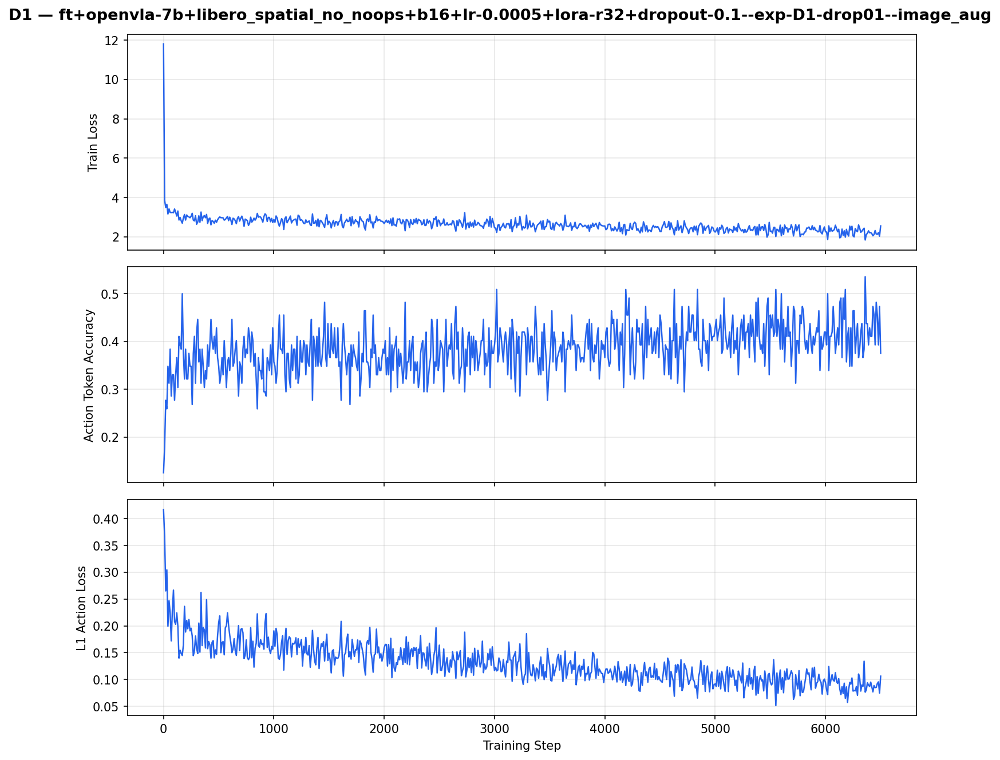 |

| A-F @ 6500 | S3k @ 3000 |
|------------|------------|
| 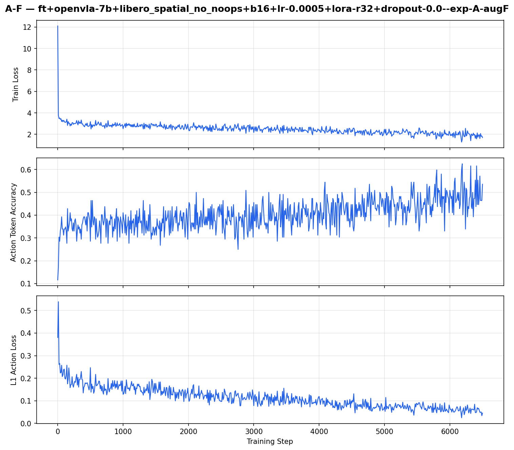 | 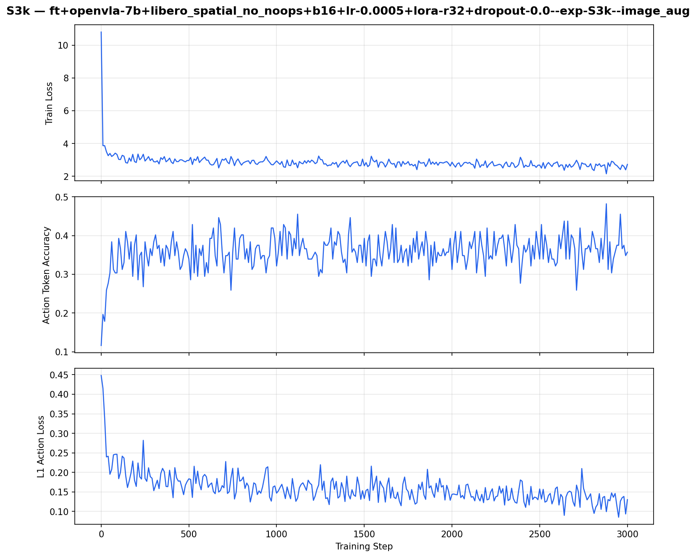 |

| S10k @ 10000（最优） |
|----------------------|
| 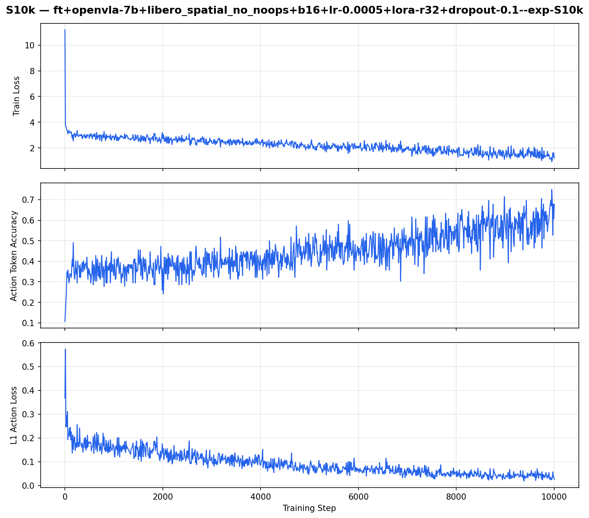 |

**训练曲线观察（与上表一致）：**

- **S10k** 在 10000 step 时 loss / accuracy 全面最优，与仿真 **70%** 一致。
- **A-F**（关 aug）优于 **D0/D1**（开 aug），说明训练分布与增强策略对收敛影响很大。
- **D1** 的 dropout + aug 并未带来更好训练指标，仿真仅略好于 D0。
- **S3k** 在 3000 step 停训时 loss 仍高、accuracy 低，与仿真 **0%** 一致。

---

## 阶段三：微调后仿真评测 — 视频演示

评测批次：`20260522-eval` · LIBERO-Spatial 前 3 任务 × 10 trials

### 任务 0 — 拿起 plate 与 ramekin 之间的黑碗

| S10k ✅ 成功 | D0 ❌ 失败 |
|-------------|-----------|
| 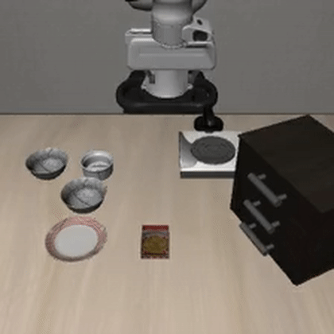 |  |
| [▶ MP4](experiments/rollouts/2026_05_24/2026_05_24-19_15_22--episode=1--success=True--task=pick_up_the_black_bowl_between_the_plate_and_the_r.mp4) | [▶ MP4](experiments/rollouts/2026_05_24/2026_05_24-16_40_01--episode=1--success=False--task=pick_up_the_black_bowl_between_the_plate_and_the_r.mp4) |

*S10k 该任务 80% · D0 该任务 20%*

### 任务 1 — 拿起 ramekin 旁边的黑碗

| A-F ✅ 成功（ep.16） | A-F ❌ 抖动/未夹稳（ep.13） | D1 ✅ 成功（ep.14） |
|---------------------|---------------------------|---------------------|
| 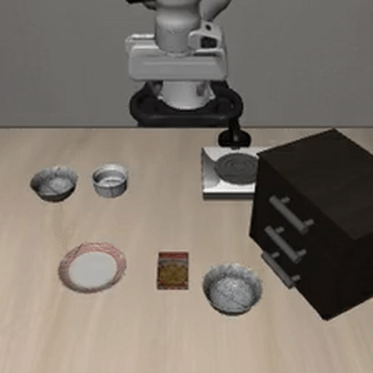 | 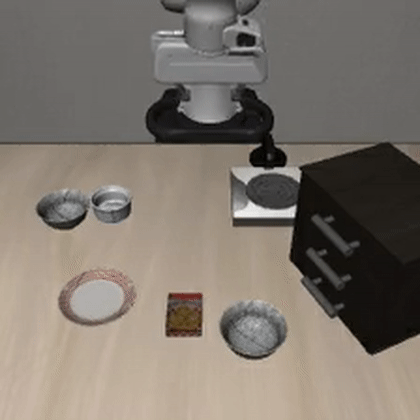 | 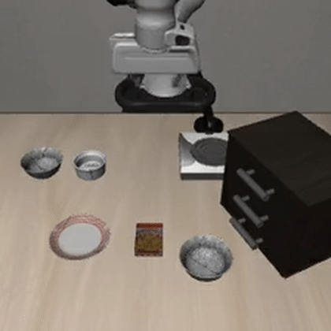 |
| [▶ MP4](experiments/rollouts/2026_05_24/2026_05_24-18_01_39--episode=16--success=True--task=pick_up_the_black_bowl_next_to_the_ramekin_and_pla.mp4) | [▶ MP4](experiments/rollouts/2026_05_24/2026_05_24-18_01_39--episode=13--success=False--task=pick_up_the_black_bowl_next_to_the_ramekin_and_pla.mp4) | [▶ MP4](experiments/rollouts/2026_05_24/2026_05_24-17_19_34--episode=14--success=True--task=pick_up_the_black_bowl_next_to_the_ramekin_and_pla.mp4) |

*A-F 该任务自动成功率 90%（9/10）· D1 60% · 失败 case 多为抖动或夹起成功但放不准。*

### 任务 2 — 拿起桌面中央的黑碗（最难）

| S10k ✅ 成功 | D0 ❌ 失败 |
|-------------|-----------|
| 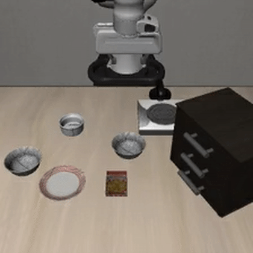 | 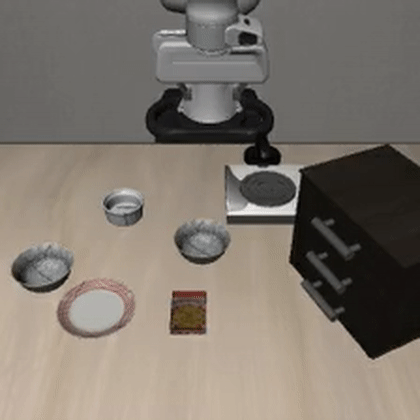 |
| [▶ MP4](experiments/rollouts/2026_05_24/2026_05_24-19_15_22--episode=28--success=True--task=pick_up_the_black_bowl_from_table_center_and_place.mp4) | [▶ MP4](experiments/rollouts/2026_05_24/2026_05_24-16_40_01--episode=21--success=False--task=pick_up_the_black_bowl_from_table_center_and_place.mp4) |

*S10k 50% · D0/D1/A-F 约 10%*

### S3k @ 3000 step — 未学到有效夹取与移动

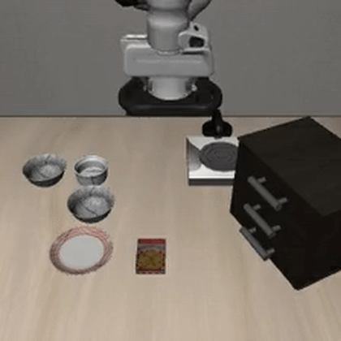

[▶ MP4 原片](experiments/rollouts/2026_05_24/2026_05_24-18_33_30--episode=5--success=False--task=pick_up_the_black_bowl_between_the_plate_and_the_r.mp4)

*30/30 episode 全部失败。回放可见机械臂在移动，但**夹取手势、接近轨迹与放置阶段**没有形成稳定的模式。*

---

## 阶段四：π₀.₅-LIBERO 横向评测（OpenPI）

评测批次：`20260526-200803-pi05` · 权重：`gs://openpi-assets/checkpoints/pi05_libero`（国内可用 [HF 镜像 `bf-jeon/pi05_libero`](https://hf-mirror.com/bf-jeon/pi05_libero) + `scripts/eval/download_pi05_libero_hf.sh`）

### Rollout 演示（任务 0，10/10 成功）

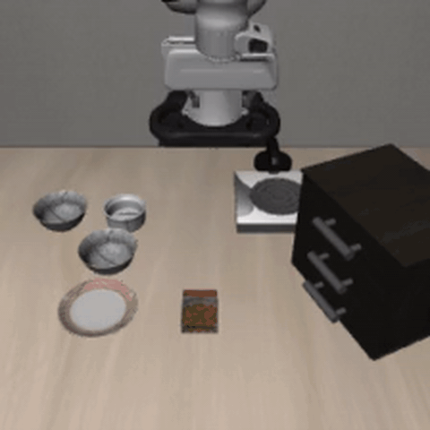

[▶ 观看 MP4 原片](experiments/rollouts_pi05/2026_05_26/2026_05_26-20_08_20--episode=1--success=True--task=pick_up_the_black_bowl_between_the_plate_and_the.mp4)

*三任务各 10 trial 全部成功；完整 30 个 MP4 见 [`experiments/rollouts_pi05/2026_05_26/`](experiments/rollouts_pi05/2026_05_26/)。*

### 复现（OpenPI，与 OpenVLA 环境分离）

```bash
git clone https://github.com/Physical-Intelligence/openpi.git
# 打补丁 + uv 环境见 patches/openpi/README.md
bash scripts/eval/setup_openpi_libero.sh
export HF_ENDPOINT=https://hf-mirror.com   # 可选：加速权重下载
bash scripts/eval/download_pi05_libero_hf.sh
bash scripts/eval/eval_pi05_libero.sh      # 默认 NUM_TASKS=3 NUM_TRIALS=10
```

---

## 失败模式与原因分析

对 `20260522-eval` 共 **150** 个 rollout 逐条回看后，失败可归纳为以下几类（**常叠加出现**）。自动成功率与**人眼观感**差距明显。

### 1. 训练不足 → 未学到有效夹取与移动（S3k 典型）

**现象：** 机械臂**有位移**，但接近、夹爪闭合、搬运与放置各阶段**不成形**——夹空、蹭到物体边缘、乱摆或半途放弃。S3k（3000 step）最明显；弱配置 D0 在难任务上也有类似表现。

| 因素 | 说明 |
|------|------|
| 训练步数过少 | S3k 仅 3000 step，W&B accuracy ~36%，策略未收敛 |
| 动作分布未对齐 | 反归一化后的 7-DoF 动作缺乏「抓—提—移—放」连贯性 |
| 开环 chunk 执行 | 单步预测误差累积，难以完成多阶段操作 |

（见上 **S3k** GIF：有动但无效。）

### 2. 末端抖动 / 高频振荡（D0 等弱配置常见）

**现象：** 夹爪或腕部在目标附近**快速抖动**，轨迹不光滑；常导致抓空、碰倒碗其他物体。

| 因素 | 说明 |
|------|------|
| 离散动作 token | 逐步反量化后相邻步差异大 |
| 图像增强 + crop 不一致 | D0/D1 训练 aug 与评测设置加重分布偏移 |
| 无动作滤波 | 单步噪声直接下发仿真 |

| D0 ❌ 抖动（任务 0，ep.1） | D0 ❌ 接近但抓空（任务 0，ep.3） |
|---------------------------|--------------------------------|
| 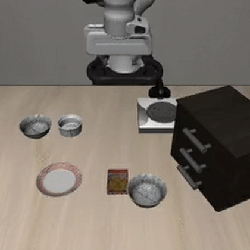 | 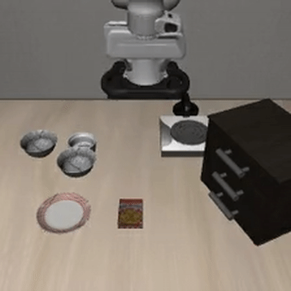 |
| [▶ MP4](experiments/rollouts/2026_05_24/2026_05_24-16_40_01--episode=1--success=False--task=pick_up_the_black_bowl_between_the_plate_and_the_r.mp4) | [▶ MP4](experiments/rollouts/2026_05_24/2026_05_24-16_40_01--episode=3--success=False--task=pick_up_the_black_bowl_between_the_plate_and_the_r.mp4) |

### 3. 夹取成功、放置失败（多模型常见）

**现象：** 回放中**能夹起黑碗甚至离开桌面**，但在移向 plate 时偏移、滑落、碰翻或停在盘外，LIBERO 仍判 `success=False`。在 D0/D1/A-F 的失败 episode 里占比较高，是拉低总成功率的主因之一；S10k 相对少见但仍存在。

| 因素 | 说明 |
|------|------|
| 两阶段难度不均 | 「抓」比「精准放到盘心」易学；后者对末端位姿更敏感 |
| 弱模型空间精度不足 | 尤其任务 2（桌面中央）放置失败集中 |
| 仿真成功判据严格 | 碗需稳定落在 plate 上，轻微偏移即失败 |

### 4. 难任务上的综合失败

**任务 2**（桌面中央）放置要求最高：S10k 约 50%，D0/D1/A-F 约 10%。多为「夹取尚可 + 放置失败」或全程无效轨迹叠加。

### 5. 配置与评测的影响

| 观察 | 解释 |
|------|------|
| A-F、S10k 明显好于 D0/D1 | 关 aug + `center_crop=False` 与训练一致 |
| 任务 1 自动成功率高 | 场景简单；失败多为抖动或放置偏移 |
| W&B loss 好 ≠ 仿真好 | 以 rollout 为准；需区分「夹取失败」与「放置失败」 |

### 6. 与 π₀.₅ 的差距（横向）

在本协议下 OpenVLA 仍常见 **放置失败** 与 **抖动**，而 π₀.₅ 在相同 3 任务上 **30/30 成功**。说明：在 LIBERO-Spatial 子集上，**LoRA 微调 7B OpenVLA** 尚未接近 **专用训练的 π₀.₅**；若要以仿真成功率为目标，需更大训练预算、观测对齐（多相机 / chunk）或更强基座，而非仅调 LoRA 超参。

### 7. 小结

- **主要瓶颈：** ① 无效/不完整操作技能（S3k）② 末端抖动（D0/D1）③ **夹取成功、放置失败**（各模型普遍）。
- **S10k** 在 OpenVLA 组内最好（70%），但远低于 π₀.₅（100%）于本协议。
- **改进方向：** 动作平滑、placement 阶段强化、观测与 action chunk 对齐、全套 10 任务 × 更多 trial。

> 完整数据：[`experiments/REPORT_libero_spatial_sweep_20260522.md`](experiments/REPORT_libero_spatial_sweep_20260522.md)

---

## 仓库结构

```
├── patches/
│   ├── openvla/              # finetune.py、run_libero_eval.py
│   └── openpi/               # LIBERO 评测客户端补丁
├── scripts/
│   ├── train/ eval/ exp/    # OpenVLA 训练与 sweep
│   └── eval/
│       ├── eval_pi05_libero.sh
│       ├── setup_openpi_libero.sh
│       └── download_pi05_libero_hf.sh
├── experiments/
│   ├── assets/gifs/          # README GIF 预览
│   ├── rollouts/2026_05_24/  # OpenVLA 150 个 MP4
│   ├── rollouts_pi05/        # π₀.₅ 30 个 MP4
│   ├── eval_logs/            # 评测文本日志
│   └── results.csv
└── run/
```

**不在本仓库：** `openvla/`、`openpi/`、`LIBERO/`、`dlimp/`、数据集、checkpoint 权重。

---

## 复现步骤

### 1. 克隆仓库并打补丁

```bash
git clone https://github.com/ZhihaoZhang01/openvla-libero-spatial-finetune.git
git clone https://github.com/openvla/openvla.git

export OPENVLA_ROOT=/path/to/openvla
export PATCH_ROOT=/path/to/openvla-libero-spatial-finetune/patches/openvla
cp "${PATCH_ROOT}/finetune.py" "${OPENVLA_ROOT}/vla-scripts/finetune.py"
cp "${PATCH_ROOT}/run_libero_eval.py" "${OPENVLA_ROOT}/experiments/robot/libero/run_libero_eval.py"
```

### 2. 环境依赖

安装 OpenVLA、LIBERO、`dlimp`，下载 **OpenVLA-7B** 与 **libero_spatial_no_noops**（见 `scripts/setup/`、`scripts/download/`）。

### 3. 训练与评测

```bash
source scripts/env/activate_openvla.sh
bash scripts/train/train_libero.sh
TRAIN_ONLY=1 SWEEP_RUN_ID=my-train bash scripts/exp/run_libero_sweep.sh
EVAL_ONLY=1  SWEEP_RUN_ID=my-eval  bash scripts/exp/run_libero_sweep.sh
```

---

## 相对上游 OpenVLA 的修改

| 文件 | 修改内容 |
|------|----------|
| `vla-scripts/finetune.py` | 权重保存到 run 目录；不 merge LoRA（防 OOM） |
| `experiments/robot/libero/run_libero_eval.py` | LIBERO 路径修复；`--num_tasks` 子集评测 |

详见 [`patches/openvla/README.md`](patches/openvla/README.md)。

---

## 致谢

- [openvla/openvla](https://github.com/openvla/openvla)
- [Physical-Intelligence/openpi](https://github.com/Physical-Intelligence/openpi)
- [Lifelong-Robot-Learning/LIBERO](https://github.com/Lifelong-Robot-Learning/LIBERO)
- [Escapist-coder/OpenVLA-Libero-Reproduction-Finetune](https://github.com/Escapist-coder/OpenVLA-Libero-Reproduction-Finetune)
- π₀.₅ 权重镜像：[bf-jeon/pi05_libero](https://huggingface.co/bf-jeon/pi05_libero)（社区上传，OpenPI JAX 格式）

---

## 引用

若使用 OpenVLA 或 LIBERO，请引用其原始论文。本仓库为个人学习记录，与官方无隶属关系。
