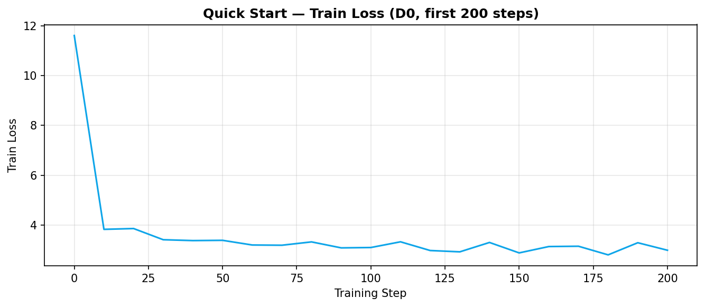
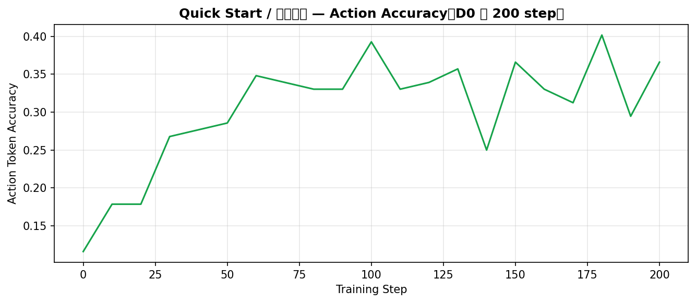

# OpenVLA × LIBERO-Spatial LoRA Finetune & Ablation

Fine-tune [OpenVLA-7B](https://github.com/openvla/openvla) on **LIBERO-Spatial** with LoRA, run a 5-config hyperparameter sweep, and evaluate in simulation. This repo contains **patches**, **automation scripts**, **experiment logs**, and **rollout videos**—not the full upstream OpenVLA tree.

**Repo:** [github.com/ZhihaoZhang01/openvla-libero-spatial-finetune](https://github.com/ZhihaoZhang01/openvla-libero-spatial-finetune)

---

## Highlights

| Item | Detail |
|------|--------|
| Base model | OpenVLA-7B |
| Benchmark | LIBERO-Spatial (`libero_spatial_no_noops`) |
| Method | LoRA (`rank=32`, `lr=5e-4`, `batch=16`) |
| Hardware | NVIDIA A800 80GB (AutoDL) |
| Best config | **S10k** — 10k steps, `dropout=0.1`, no image aug |
| Eval protocol | First **3 tasks** × **10 trials** = 30 episodes / model |

### Simulation success rate (sweep `20260522-eval`)

| Rank | Config | Steps | Dropout | Aug | Success |
|------|--------|-------|---------|-----|---------|
| 1 | **S10k** | 10000 | 0.1 | off | **70.0%** (21/30) |
| 2 | **A-F** | 6500 | 0.0 | off | **50.0%** (15/30) |
| 3 | D1 | 6500 | 0.1 | on | 26.7% (8/30) |
| 4 | D0 | 6500 | 0.0 | on | 16.7% (5/30) |
| 5 | S3k | 3000 | 0.0 | on | 0.0% (0/30) |

Per-task breakdown: see [`experiments/REPORT_libero_spatial_sweep_20260522.md`](experiments/REPORT_libero_spatial_sweep_20260522.md) and [`experiments/results.csv`](experiments/results.csv).

---

## Quick Start — Base Model Smoke Test

Before finetuning, we verified the stack (GPU, LIBERO sim, OpenVLA-7B load) with `run/quick_start.py` on a **pretrained** checkpoint—no LoRA.

### Rollout video (unfinetuned base)

<video controls width="640" src="experiments/demos/quick_start_spatial_pick_black_bowl.mp4"></video>

*Task: pick up the black bowl and place it on the plate (spatial suite). Base model shows intent but low success.*

### Training curves — smoke / sanity (insert your screenshots)

| Chart | Placeholder path | What to paste |
|-------|------------------|---------------|
| Loss | `experiments/assets/training_curves/quick_start_loss.png` | W&B `train/loss` (if logged) or note “N/A — inference only” |
| Action accuracy | `experiments/assets/training_curves/quick_start_action_accuracy.png` | Optional base-model metric |





> Replace the images above after exporting from W&B. See [`experiments/assets/training_curves/README.md`](experiments/assets/training_curves/README.md).

---

## Ablation Sweep — Training Curves

Five LoRA runs (`20260522-train`). Fixed: `lora_rank=32`, `lr=5e-4`, `batch=16`, dataset `libero_spatial_no_noops`.

| ID | `lora_dropout` | `image_aug` | `max_steps` | Description |
|----|----------------|-------------|-------------|-------------|
| D0 | 0.0 | on | 6500 | Baseline |
| D1 | 0.1 | on | 6500 | Dropout ablation |
| A-F | 0.0 | **off** | 6500 | Augmentation off |
| S3k | 0.0 | on | **3000** | Short training |
| S10k | 0.1 | **off** | **10000** | Long training (best) |

### Overview (all runs — insert one comparison plot)


### Per-run curves (insert W&B screenshots)

| D0 @ 6500 | D1 @ 6500 |
|-----------|-----------|
|  |  |

| A-F @ 6500 | S3k @ 3000 |
|------------|------------|
|  |  |

| S10k @ 10000 (best) |
|---------------------|
|  |

**Training observations (W&B, qualitative):**

- **S10k** reached the best train metrics at 10k steps (lowest loss, highest action-token accuracy).
- **A-F** (no aug) trained more stably than **D1** (dropout 0.1 + aug) at the same 6500 steps.
- **S3k** underfit clearly—consistent with **0%** sim success.

---

## Evaluation Demos — Finetuned Policies

Eval batch: `20260522-eval` · 3 LIBERO-Spatial tasks × 10 trials · videos under [`experiments/rollouts/2026_05_24/`](experiments/rollouts/2026_05_24/).

### Task 0 — Bowl between plate and ramekin

| S10k ✅ Success | D0 ❌ Failure |
|----------------|---------------|
| <video controls width="300" src="experiments/rollouts/2026_05_24/2026_05_24-19_15_22--episode=1--success=True--task=pick_up_the_black_bowl_between_the_plate_and_the_r.mp4"></video> | <video controls width="300" src="experiments/rollouts/2026_05_24/2026_05_24-16_40_01--episode=1--success=False--task=pick_up_the_black_bowl_between_the_plate_and_the_r.mp4"></video> |

*S10k: 80% on this task · D0: 20%*

### Task 1 — Bowl next to ramekin

| A-F ✅ Success | D1 ✅ Success |
|---------------|---------------|
| <video controls width="300" src="experiments/rollouts/2026_05_24/2026_05_24-18_01_39--episode=11--success=True--task=pick_up_the_black_bowl_next_to_the_ramekin_and_pla.mp4"></video> | <video controls width="300" src="experiments/rollouts/2026_05_24/2026_05_24-17_19_34--episode=11--success=True--task=pick_up_the_black_bowl_next_to_the_ramekin_and_pla.mp4"></video> |

*A-F: 90% · D1: 60% · Easiest sub-task in our subset.*

### Task 2 — Bowl at table center (hardest)

| S10k ✅ Success | D0 ❌ Failure |
|----------------|---------------|
| <video controls width="300" src="experiments/rollouts/2026_05_24/2026_05_24-19_15_22--episode=28--success=True--task=pick_up_the_black_bowl_from_table_center_and_place.mp4"></video> | <video controls width="300" src="experiments/rollouts/2026_05_24/2026_05_24-16_40_01--episode=21--success=False--task=pick_up_the_black_bowl_from_table_center_and_place.mp4"></video> |

*S10k: 50% · D0/D1/A-F: ~10% — main bottleneck for weaker configs.*

### S3k @ 3000 steps — complete failure

<video controls width="480" src="experiments/rollouts/2026_05_24/2026_05_24-18_33_30--episode=1--success=False--task=pick_up_the_black_bowl_between_the_plate_and_the_r.mp4"></video>

*0/30 episodes succeeded; model never learned usable spatial policies at 3k steps.*

---

## Repository Layout

```
├── patches/openvla/          # finetune.py & run_libero_eval.py patches (+ upstream.diff)
├── scripts/
│   ├── env/                  # activate_openvla.sh
│   ├── train/                # LoRA training
│   ├── eval/                 # single-checkpoint eval
│   └── exp/                  # 5-run sweep (experiments.conf, run_libero_sweep.sh)
├── experiments/
│   ├── rollouts/             # 150 eval MP4s (2026_05_24)
│   ├── demos/                # quick_start base-model videos
│   ├── eval_logs/            # per-model EVAL text logs
│   ├── runs/                 # sweep metadata (no weights)
│   ├── assets/training_curves/  # ← put W&B PNGs here
│   └── results.csv
└── run/                      # verify_phase01.py, quick_start.py, …
```

**Not in this repo:** `openvla/`, `LIBERO/`, `dlimp/`, datasets, base weights, LoRA checkpoints (~465MB each).

---

## Reproduce

### 1. Clone & apply patches

```bash
git clone https://github.com/ZhihaoZhang01/openvla-libero-spatial-finetune.git
git clone https://github.com/openvla/openvla.git

export OPENVLA_ROOT=/path/to/openvla
export PATCH_ROOT=/path/to/openvla-libero-spatial-finetune/patches/openvla
cp "${PATCH_ROOT}/finetune.py" "${OPENVLA_ROOT}/vla-scripts/finetune.py"
cp "${PATCH_ROOT}/run_libero_eval.py" "${OPENVLA_ROOT}/experiments/robot/libero/run_libero_eval.py"
```

### 2. Environment

Install OpenVLA, LIBERO, `dlimp`, download **OpenVLA-7B** and **libero_spatial_no_noops** RLDS (see `scripts/setup/`, `scripts/download/`).

### 3. Train & evaluate

```bash
source scripts/env/activate_openvla.sh

# Single baseline
bash scripts/train/train_libero.sh

# Full 5-config sweep
TRAIN_ONLY=1 SWEEP_RUN_ID=my-train bash scripts/exp/run_libero_sweep.sh
EVAL_ONLY=1  SWEEP_RUN_ID=my-eval  bash scripts/exp/run_libero_sweep.sh
```

---

## Patches vs upstream OpenVLA

| File | Change |
|------|--------|
| `vla-scripts/finetune.py` | Save adapter to run dir; skip LoRA merge at end (OOM on 80GB) |
| `experiments/robot/libero/run_libero_eval.py` | LIBERO path fix; `--num_tasks` for subset eval |

Details: [`patches/openvla/README.md`](patches/openvla/README.md)

---

## Acknowledgements

- [openvla/openvla](https://github.com/openvla/openvla) — base VLA
- [Lifelong-Robot-Learning/LIBERO](https://github.com/Lifelong-Robot-Learning/LIBERO) — benchmark & sim
- [Escapist-coder/OpenVLA-Libero-Reproduction-Finetune](https://github.com/Escapist-coder/OpenVLA-Libero-Reproduction-Finetune) — reproduction reference & README structure inspiration

---

## Citation

If you use OpenVLA or LIBERO, please cite their respective papers. This repo is an independent reproduction log for learning and ablation study.
